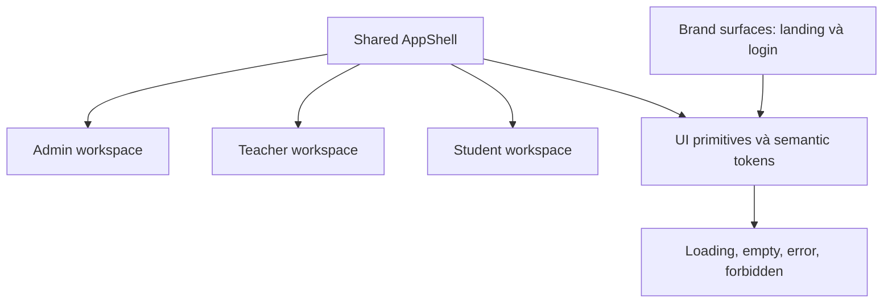
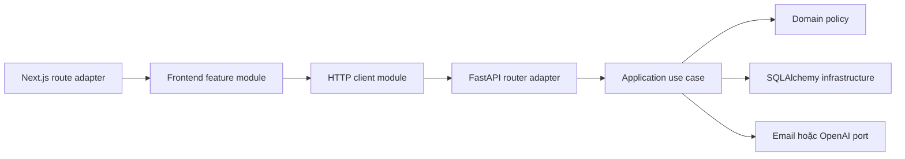

# Blueprint trùng tu SchoolManager

Tài liệu này là đường biên cho cuộc trùng tu toàn bộ SchoolManager. Mục tiêu không phải đổi màu từng trang, mà là đưa dự án về một nền tảng mã nguồn mở an toàn, nhất quán, dễ đóng góp và vẫn chạy được sau mỗi giai đoạn.

## 1. Design read

SchoolManager là một sản phẩm quản lý trường học dành cho quản trị viên, giáo viên và học sinh Việt Nam. Ngôn ngữ thiết kế cần đáng tin cậy, thân thiện và có kỷ luật. Nền tảng được giữ ở dạng modular monolith, dùng Next.js, FastAPI và một design system sở hữu trong repo.

Các dial thiết kế:

| Dial | Giá trị | Ý nghĩa |
|---|---:|---|
| `DESIGN_VARIANCE` | 5 | Bố cục có nhịp điệu nhưng không thử nghiệm quá mức |
| `MOTION_INTENSITY` | 3 | Chuyển động chỉ dùng cho phản hồi và thay đổi trạng thái |
| `VISUAL_DENSITY` | 5 | Đủ chặt cho công việc hằng ngày, không biến thành bảng điều khiển ngột ngạt |

## 2. Audit hiện trạng

### 2.1 Tài sản nên giữ

- Tên `SchoolManager` và biểu tượng mũ tốt nghiệp hiện tại đã truyền đạt đúng chủ đề.
- Cấu trúc URL tiếng Việt hiện tại đã tạo thành thói quen sử dụng. Không đổi slug trong giai đoạn trùng tu giao diện.
- Ba vai trò chính đã có luồng riêng và phần lớn chức năng nghiệp vụ đã tồn tại.
- Màn hình đăng nhập có chủ đề học đường rõ ràng. Chủ đề này được giữ bằng ảnh thật và logo; khối SVG nhân vật hơn 500 dòng được loại bỏ để form dễ bảo trì và tôn trọng reduced-motion.
- Tailwind v4, Recharts và Lucide đã có sẵn. Giai đoạn đầu không thêm component library mới.

### 2.2 Vấn đề cần loại bỏ

- 69 file TSX/CSS đang có khoảng 2.328 inline-style, 1.930 mã màu và 148 gradient. Token hiện tại không kiểm soát được giao diện.
- Landing, admin, teacher và student dùng các palette, radius, spacing và navigation khác nhau.
- Admin dùng CSS module hơn 1.000 dòng; teacher dựa nhiều vào inline-style; student dashboard hơn 1.200 dòng và gộp dữ liệu, modal, điều hướng, gamification vào cùng một component.
- Landing page dùng dark-tech, glow, gradient text và số liệu marketing chưa có nguồn. Hướng này không phù hợp với một sản phẩm trường học cần tạo niềm tin.
- Loading chủ yếu là spinner; empty, error và permission-denied state không thống nhất.
- Nhiều emoji đang đóng vai trò icon. Điều này làm giọng điệu sản phẩm thiếu nhất quán và khó kiểm soát accessibility.
- `src/lib/api.ts` đang là một module nông hơn 600 dòng, gộp type, auth header và API của nhiều domain.
- Backend router chứa cả transport, phân quyền, truy vấn và business logic. Interface thực tế vì vậy quá rộng và khó test.
- Bộ test tự động gần như chưa tồn tại.

### 2.3 Release blockers đã xác minh trong code review

Các mục này phải được xử lý trước khi công bố giao diện mới như một bản phát hành ổn định:

1. Người dùng có thể tự chọn role khi tạo tài khoản, kể cả `admin`.
2. Nhiều thao tác quản trị người dùng và lớp học thiếu kiểm tra role hoặc quyền sở hữu.
3. Secret JWT có giá trị mặc định yếu nếu môi trường triển khai không ghi đè.
4. Một số API hoạt động, lời mời, bài tập, quiz và quiz battle thiếu kiểm tra xác thực hoặc phạm vi lớp.
5. Answer key và dữ liệu nhạy cảm có thể đi qua response không phù hợp với vai trò.
6. Repo chứa cấu hình nhạy cảm và credential demo không nên được dùng cho production.
7. Dependency frontend hiện có cảnh báo bảo mật mức cao.

## 3. Ngôn ngữ thiết kế đích

### 3.1 Hướng hình ảnh

Tên nội bộ: **Campus Blue**.

- Light-first cho màn hình nghiệp vụ; dark mode dùng cùng semantic tokens và theo system preference.
- Nền trung tính mát, chữ xanh đen, một accent xanh học đường. Teal từ logo chỉ là màu hỗ trợ trong tài sản thương hiệu, không thành CTA thứ hai.
- Không dùng glow, mesh gradient, gradient text hoặc glassmorphism trong dashboard.
- Status colors chỉ mang nghĩa nghiệp vụ: success, warning, danger, info.
- Hình ảnh trường học dùng ảnh thật hoặc tài sản minh họa có chủ đích. Không dùng stock giả làm dữ liệu sản phẩm.

### 3.2 Token nền tảng

Token phải mang ý nghĩa, không mang tên màu cụ thể:

```css
--surface-canvas
--surface-panel
--surface-subtle
--border-default
--border-strong
--text-primary
--text-secondary
--text-muted
--action-primary
--action-primary-hover
--focus-ring
--status-success
--status-warning
--status-danger
--status-info
```

Quy tắc hình khối:

- Card và panel: radius 16px.
- Input, button và menu item: radius 10px.
- Avatar và status indicator mới dùng hình tròn.
- Không dùng pill cho action thông thường.
- Shadow chỉ dùng khi cần thể hiện elevation thật, ví dụ popover, dialog và sticky header.

### 3.3 Typography và icon

- Dùng một sans-serif hỗ trợ tiếng Việt qua `next/font`.
- Heading ưu tiên weight và khoảng cách, không dùng gradient text.
- Giữ Lucide trong giai đoạn đầu vì đã là dependency của dự án. Chuẩn hóa `strokeWidth` và không trộn thêm icon family.
- Thay emoji mang chức năng bằng icon. Emoji chỉ còn trong nội dung có tính biểu cảm của học sinh, ví dụ mood journal.

### 3.4 Motion và accessibility

- Chỉ animate `transform` và `opacity`.
- Mọi chuyển động không thiết yếu phải tắt dưới `prefers-reduced-motion`.
- Form luôn có label phía trên, helper text khi cần, error bên dưới.
- Focus state rõ ràng và đạt WCAG AA.
- Mọi feature phải có loading, empty, error, forbidden và success state phù hợp.
- Mobile dùng `min-height: 100dvh`; layout nhiều cột phải có fallback một cột rõ ràng dưới 768px.

## 4. Kiến trúc trải nghiệm

Ba vai trò dùng cùng một `AppShell`, nhưng cấu hình navigation và density khác nhau.



### Admin workspace

- Sidebar cố định trên desktop, drawer trên mobile.
- Điều hướng chính: Tổng quan, Giáo viên, Lớp học, Học sinh, Cài đặt.
- Mật độ cao nhất trong ba vai trò; table, filter và bulk action phải nhất quán.

### Teacher workspace

- Chuyển từ top-nav chật sang sidebar hoặc rail co giãn.
- Nhóm navigation theo công việc: Giảng dạy, Đánh giá, Theo dõi, Hỗ trợ học sinh.
- Dashboard ưu tiên việc cần xử lý hôm nay, không ưu tiên metric trang trí.

### Student workspace

- Navigation đơn giản, ưu tiên Lịch học, Môn học, Bài cần làm, Thành tích và Hỗ trợ.
- Giọng điệu thân thiện hơn nhưng vẫn dùng chung token và component.
- Gamification là một feature, không được chi phối toàn bộ dashboard bằng nhiều màu accent.

## 5. Kiến trúc code đích

### 5.1 Frontend

```text
src/
  app/                         # route adapters, giữ URL hiện tại
  components/
    ui/                        # Button, Input, Dialog, Badge, DataTable
    shell/                     # AppShell, Sidebar, Topbar, RoleNavigation
    states/                    # LoadingState, EmptyState, ErrorState, ForbiddenState
  features/
    auth/
    classes/
    people/
    assignments/
    quizzes/
    schedule/
    wellness/
    gamification/
    notifications/
  lib/
    http/                      # client, error mapping, auth transport
    auth/                      # session và route policy
    formatting/               # date, number, score
  styles/
    tokens.css
    base.css
```

Nguyên tắc module:

- `app/` chỉ là adapter giữa route và feature.
- Mỗi feature nhận dependency, thực hiện công việc và trả kết quả qua interface nhỏ.
- `lib/http` là một module sâu: một interface request ổn định che giấu token transport, parse JSON và mapping lỗi.
- Không tạo generic repository phía frontend.
- UI primitive chỉ được tạo khi có ít nhất hai consumer thực tế.
- Interface của feature là test surface; test observable behavior, không test state nội bộ.

### 5.2 Backend

```text
backend/app/
  api/                         # FastAPI routers và response mapping
  application/                 # use cases theo domain
  domain/                      # policy, rule và value object thuần
  infrastructure/             # SQLAlchemy, email, OpenAI, file storage
  schemas/                     # request/response theo actor
  tests/
```

Các module sâu cần ưu tiên:

- `authorization`: `require_role`, `require_class_access`, `require_resource_owner`.
- `identity`: đăng nhập, session, invite và provisioning user.
- `assessment`: quiz, answer visibility, submission và grading policy.
- `coursework`: assignment, submission và feedback.
- `wellbeing`: mood entry, SOS và quyền xem dữ liệu nhạy cảm.

Không tạo port cho mọi database call. SQLAlchemy hiện là một adapter duy nhất nên abstraction repository tổng quát chỉ tạo thêm indirection. Port chỉ được thêm tại seam có production adapter và test adapter thật, ví dụ email hoặc OpenAI.



## 6. Roadmap triển khai

### Giai đoạn 0: Safety baseline

Mục tiêu: biến repo thành nền đủ an toàn để tiếp tục phát triển.

- Khóa đăng ký role và toàn bộ admin CRUD bằng RBAC phía server.
- Thêm ownership và class-scope policy cho quiz, assignment, activity, invitation, battle và wellness.
- Xóa secret mặc định; fail fast nếu production thiếu secret.
- Ngừng theo dõi private key và credential production; rotate secret bên ngoài repo.
- Cập nhật dependency có advisory mức cao.
- Thêm Alembic; loại bỏ migration tự phát trong startup.
- Thêm pytest cho authz và test integration cho các luồng critical.
- Thêm frontend check tối thiểu: typecheck, lint và build trong CI.

Điều kiện hoàn thành: không còn Critical finding đã biết, test policy chạy trong CI, secret production không nằm trong Git.

### Giai đoạn 1: Design foundation và pilot

Mục tiêu: tạo lát cắt dọc đầu tiên, chưa migrate hàng loạt.

- Tạo semantic tokens và base styles cho light/dark.
- Tạo các primitive đầu tiên: Button, Input, Field, Dialog, Badge, Skeleton, EmptyState, ErrorState.
- Tạo `AppShell` và cấu hình navigation theo role.
- Redesign landing và login theo Campus Blue; giữ logo, URL và hành vi đăng nhập.
- Migrate admin overview làm màn hình pilot nghiệp vụ.
- Thêm screenshot baseline cho desktop và mobile.

Điều kiện hoàn thành: landing, login và admin overview chạy end-to-end; không thêm inline-style mới; accessibility và responsive pass ở các màn hình pilot.

### Giai đoạn 2: Core school workflows

Mục tiêu: migrate các luồng tạo ra giá trị trường học chính.

- Admin: giáo viên, học sinh, lớp học.
- Teacher: lớp học, bài tập, kiểm tra, thời khóa biểu.
- Student: dashboard, môn học, bài tập, quiz, thời khóa biểu.
- Tách `src/lib/api.ts` theo feature và dùng chung error model.
- Chuẩn hóa table, filter, pagination, form và confirmation flow.

Điều kiện hoàn thành: các luồng CRUD cốt lõi có test API và browser test; tất cả route cũ vẫn hoạt động.

### Giai đoạn 3: Backend deepening

Mục tiêu: đưa business logic ra khỏi router mà không tạo microservice giả.

- Di chuyển từng domain theo vertical slice, bắt đầu với assessment và coursework.
- Tách request schema khỏi response schema theo role.
- Chuẩn hóa transaction, error và audit event.
- Xóa test cũ bám implementation sau khi interface test mới đã bao phủ hành vi.

Điều kiện hoàn thành: router chỉ làm transport, policy được test trực tiếp, không tăng số abstraction không có consumer.

### Giai đoạn 4: Student wellbeing và engagement

Mục tiêu: làm trải nghiệm học sinh thân thiện nhưng không biến thành giao diện trò chơi hỗn loạn.

- Migrate wellness, mood journal, notification, achievement, quiz battle và mini-games.
- Áp dụng privacy-first cho dữ liệu sức khỏe tinh thần.
- Giữ animation ở mức phản hồi; cung cấp reduced-motion.
- Đánh giá lại AI tutor và chatbot như feature độc lập, có state và quota rõ ràng.

Điều kiện hoàn thành: dữ liệu wellbeing có policy test; mobile và keyboard navigation pass; gamification không phá palette chung.

### Giai đoạn 5: Open-source readiness và release

Mục tiêu: làm repo dễ hiểu và dễ đóng góp.

- Đồng bộ README, ARCHITECTURE, API, CONTRIBUTING với code thật.
- Bỏ tuyên bố tính năng hoàn thành nếu chưa có evidence.
- Tách demo seed khỏi production provisioning.
- Thêm issue template cho migration, design system và security.
- Gắn screenshot, migration note và test evidence vào PR template.
- Thêm observability tối thiểu: request ID, structured logs, error reporting và health checks.

Điều kiện hoàn thành: người mới có thể chạy local từ tài liệu; release checklist tái lập được; không cần credential dùng chung.

## 7. Phạm vi lát cắt đầu tiên

Lát cắt đầu tiên nên được triển khai theo thứ tự sau:

1. Backend RBAC và secret fail-fast.
2. Test policy cho user/class/assessment ownership.
3. Frontend tokens, base styles và primitive có test surface rõ ràng.
4. Shared `AppShell` với cấu hình Admin.
5. Landing, login và admin overview.
6. Build, lint, API tests và screenshot review.

Không nằm trong lát cắt đầu tiên:

- Đổi URL hoặc tên navigation chính.
- Viết lại database schema toàn bộ.
- Thay icon library.
- Thêm state-management library.
- Tách microservice.
- Redesign 40 route trong một PR.

## 8. Quality gates cho mọi PR trùng tu

- Không làm yếu RBAC hoặc quyền sở hữu tài nguyên.
- Không đưa secret, key, password hoặc credential demo production vào Git.
- Không thêm inline-style mới nếu semantic token hoặc component có thể biểu đạt.
- Không dùng raw hex trong feature component.
- Có loading, empty, error và forbidden state khi luồng có thể rơi vào các trạng thái đó.
- Desktop, tablet và mobile được kiểm tra cho route bị tác động.
- Light và dark mode đều đạt contrast.
- Motion tôn trọng reduced-motion.
- Route slug, field name và hành vi public không đổi nếu chưa có migration note.
- Test tập trung vào interface và observable behavior.
- Mỗi PR chỉ migrate một vertical slice có thể review được.

## 9. Quyết định đã khóa

- Chọn full visual overhaul nhưng giữ logo, nội dung cốt lõi và URL hiện tại trong giai đoạn đầu.
- Chọn modular monolith; không chia microservice.
- Chọn Tailwind v4 và component sở hữu trong repo; chưa thêm design-system dependency.
- Chọn light-first, system dark mode và một accent xanh học đường.
- Ưu tiên security baseline trước khi gọi phiên bản mới là ổn định.
- Migrate theo vertical slice, không rewrite toàn bộ cùng lúc.

## 10. Trạng thái triển khai ngày 2026-08-05

Lát cắt đầu tiên đã hoàn thành và có evidence chạy local:

| Hạng mục | Trạng thái | Evidence |
|---|---|---|
| Safety baseline | Hoàn thành | Shared authorization policy, secret fail-fast, scoped RBAC, upload validation |
| Dependency hygiene | Hoàn thành baseline | `npm audit --audit-level=high` báo 0 vulnerability; `python -m pip_audit -r requirements.txt` báo không có vulnerability đã biết |
| Backend policy và workflow tests | Hoàn thành | 30 test pass cho role, class scope, domain/application/OpenAPI workflow, wellbeing, operational readiness và first-admin provisioning |
| CI | Hoàn thành | Frontend audit/lint/typecheck/build; backend audit/compileall/pytest |
| Design foundation | Hoàn thành | Campus Blue tokens, Be Vietnam Pro, Button, Surface, states và `RoleShell` |
| Pilot screens | Hoàn thành | Landing, login, Admin Overview responsive; public/auth hỗ trợ system dark mode |
| Browser smoke | Hoàn thành | 7 ảnh baseline, không console error, không tràn ngang |
| Core school workflows | Hoàn thành | Admin people/classes; Teacher classes/assignments/quizzes/schedule; Student dashboard/subjects/coursework/schedule |
| Frontend API seam | Hoàn thành | `apiRequest`, `ApiError` và module academic/admin/coursework/extensions; `src/lib/api.ts` chỉ còn compatibility facade |
| Workflow primitives | Hoàn thành | DataTable, FilterToolbar, Pagination, Field, Dialog và ConfirmDialog có keyboard/focus behavior chung |
| Phase 2 browser smoke | Hoàn thành | 3 role trên production build, desktop/mobile, dialog/drawer, không console error hoặc tràn ngang |
| Phase 3 backend deepening | Hoàn thành cho assessment/coursework | `Coursework` và `Assessment` application interface; router không query/commit; schema theo actor; transaction, error mapping và audit event dùng chung |
| Phase 4 student wellbeing và engagement | Hoàn thành lát cắt chính | Wellbeing application/policy/schema + 14 workflow tests; Campus Blue cho mood, notifications, achievements, AI Tutor, Quiz Battle và mini-games; production build smoke desktop/mobile/dark/keyboard không console error hoặc tràn ngang |
| Phase 5 open-source readiness và release | Hoàn thành baseline | README/API/ARCHITECTURE/CONTRIBUTING/DEPLOYMENT khớp code; issue/PR evidence templates; explicit schema/admin provisioning; request ID, structured error logs, liveness/readiness; audit và 30 test pass |

Các giới hạn còn chủ động giữ lại:

- `RoleShell` hiện được dùng cho cả Admin, Teacher và Student. Các feature wellbeing, gamification và mini-game đã đi qua lát cắt Phase 4; các route legacy ngoài danh sách này vẫn cần migrate dần.
- Alembic hiện là adoption baseline cho các cột quiz cũ, chưa phải lịch sử khởi tạo toàn bộ schema.
- Các router ngoài assessment/coursework vẫn là legacy slice và chỉ được migrate khi domain tương ứng được triển khai; ADR-001 cấm thêm generic repository dùng trước nhu cầu.
- Pytest còn một `StarletteDeprecationWarning` từ FastAPI TestClient về lớp tương thích `httpx`; mã ứng dụng không còn cảnh báo `class Config` của Pydantic v2.
- Certificate đã bị xóa khỏi working tree nhưng vẫn tồn tại trong Git history cũ. Người vận hành phải thu hồi và cấp lại certificate bên ngoài repo.
- Session frontend vẫn lưu token trong `localStorage`; migration sang cookie HttpOnly cần một thay đổi hợp đồng auth riêng.
- Login/API chưa có rate limiting; đây là security hardening còn mở và cần thiết kế theo deployment topology trước khi bật.
- Observability Phase 5 mới là baseline request ID/structured event/health probe; metrics, tracing, log aggregation và alert delivery thuộc hạ tầng triển khai và chưa được cấu hình trong repo.
